# Stratum — Enterprise Data Platform

A production-grade lakehouse architecture designed for 
enterprise AI readiness. Built on Azure Databricks, 
Delta Lake, dbt Core, and Terraform.

---

## The problem this solves

Most companies asking for AI already have data. 
What they don't have is data infrastructure designed 
to support AI workloads.

Reporting infrastructure answers known questions about 
historical data. AI infrastructure needs to answer 
unknown questions about live data — feeding models that 
require freshness, consistency, lineage, and governance 
simultaneously.

Stratum is a reference implementation of the foundational 
layer that enterprise AI requires. It is not a proof of 
concept. It is a documented, tested, governed architecture 
that can be evaluated, extended, and deployed.

---

## Architecture

### Full platform overview



### CI/CD and governance pipeline



---

## What is built

### Ingestion layer
Batch ingestion of the NYC Yellow Taxi public dataset 
(2,964,624 rows, January 2024) into a bronze Delta layer 
on Databricks Unity Catalog. Downloaded via the NYC TLC 
public API, read with pandas, converted to a Spark 
DataFrame, and written as Delta with overwrite semantics 
and schema enforcement disabled — preserving the source 
schema exactly as received.

The bronze layer is immutable and append-only. Every 
write is recorded in the Delta transaction log. 
DESCRIBE HISTORY returns a complete audit trail of every 
operation on the table.

### Storage layer
ADLS Gen2 with hierarchical namespace enabled. Delta Lake 
as the table format across all three medallion layers. 
Unity Catalog for column-level lineage and governance. 
Three schemas — bronze, silver, gold — each with a 
distinct contract that the architecture enforces 
structurally, not just by convention.

### Transformation layer
dbt Core connected to Databricks via OAuth. The silver 
model is an incremental materialisation with a merge 
strategy — on each run it processes only records newer 
than the most recent pickup_datetime in the target table. 
Full refresh is available for schema migrations.

The silver model enforces seven transformations:

- Type casting from source types to explicit typed columns
- Snake_case renaming for consistency across the semantic layer
- Surrogate key generation via MD5 over six source fields 
  plus a row_number window function — required because the 
  NYC taxi dataset contains records where every field 
  including fare amount and location IDs is identical
- Derived field calculation — trip_duration_seconds from 
  unix_timestamp arithmetic
- Business logic validation — removing passenger counts 
  outside 1-8, trip distances outside 0-500 miles, fares 
  outside 0-1000 USD, and trips where dropoff precedes pickup
- Audit column — _loaded_at timestamp on every row
- Incremental filter — where clause scoped to is_incremental()

The gold model is a table materialisation — a business 
aggregate by pickup zone and hour of day showing total 
trips, average distance, average duration, average fare, 
total revenue, and average tip rate. Designed for 
Power BI DirectQuery connection.

### Quality layer
12 schema tests on the silver model enforcing not_null 
on all critical columns, uniqueness on trip_id, and 
accepted_values on vendor_id. 3 schema tests on the 
gold model. 15 tests total — all passing.

Tests are not optional in this architecture. A model 
that fails its tests does not get promoted. The test 
is the contract.

### Governance layer
Unity Catalog provides column-level lineage from bronze 
through silver to gold. Every table is registered in the 
dbw_stratum_dev catalog with explicit schema assignment. 
The lineage graph is available in the Databricks UI 
without additional instrumentation.

### Infrastructure layer
The dev environment is fully provisioned by Terraform. 
Resource group, ADLS Gen2 storage account with 
hierarchical namespace, Databricks workspace, and cluster 
policy are all defined as code and reproducible from 
a clean Azure subscription in under 15 minutes.

The cluster policy enforces 20-minute auto-termination 
and restricts node types to Standard_DS3_v2 and 
Standard_DS4_v2. This is not a recommendation — it is 
a policy enforced at the platform level.

---

## What the production version looks like

This is a Minimum Credible Architecture built in three 
weeks. A production deployment extends it with:

- Event Hub streaming ingestion alongside batch — 
  real-time data freshness for operational AI workloads
- Multi-environment Terraform with remote state in 
  Azure Blob — separate state files per environment 
  prevent cross-environment blast radius
- dbt slim CI using state-modified — tests only models 
  affected by a given pull request, reducing CI runtime 
  from 45 minutes to under 5
- Great Expectations data quality checkpoints blocking 
  promotion between layers on failure
- OpenLineage events emitted to Marquez for 
  cross-platform lineage visible outside Databricks
- Databricks SQL freshness alerts on pipeline SLA — 
  alerting not just on failure but on delay

Timeline for full production deployment: 
12-15 weeks at 10-15 hours per week.

---

## Stack

| Layer | Technology |
|---|---|
| Compute | Azure Databricks (Premium, Unity Catalog) |
| Storage | ADLS Gen2, Delta Lake |
| Transformation | dbt Core 1.10, Apache Spark |
| Governance | Unity Catalog, Delta transaction log |
| IaC | Terraform 1.5, AzureRM provider |
| CI/CD | GitHub Actions |
| Quality | dbt schema tests (15 passing) |
| Dataset | NYC Yellow Taxi 2024-01 (2,964,624 rows) |

---

## How to reproduce this

**Prerequisites:** Azure subscription, Terraform 1.5+, 
dbt-databricks 1.10+, Python 3.9+

**Step 1 — Provision the dev environment**

```bash
cd infra/environments/dev
terraform init
terraform plan -var-file="dev.tfvars"
terraform apply -var-file="dev.tfvars"
```

**Step 2 — Run the ingestion pipeline**

Open notebook `ingestion/batch/01_ingest_nyc_taxi_bronze` 
in the Databricks workspace and run all cells. 
Approximately 35 seconds end to end.

**Step 3 — Register the bronze table**

Open notebook `ingestion/batch/02_register_bronze_tables` 
and run all cells. Verifies 2,964,624 rows.

**Step 4 — Run the dbt pipeline**

```bash
cd transformation/dbt_project
dbt run
dbt test
```

Expected output: PASS=2 for models, PASS=15 for tests.

---

## Cost

Running this architecture in an Azure dev environment 
costs approximately 30-50 euros per month with the 
cluster auto-termination policy enforced. The largest 
cost driver is the Databricks workspace — the cluster 
policy limits node size and enforces 20-minute 
auto-termination to prevent runaway compute costs.

---

