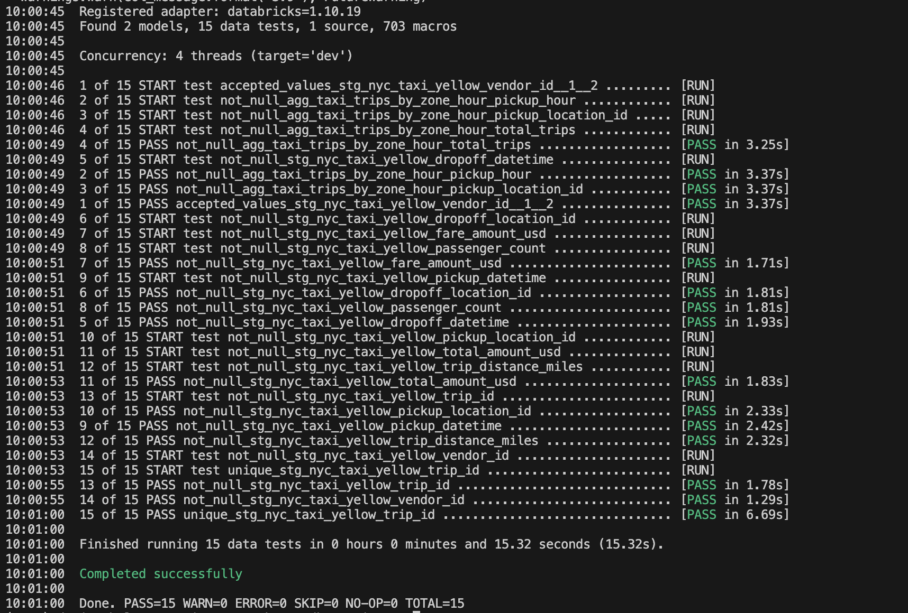

# Stratum: Enterprise Data Platform

A lakehouse architecture built for AI workload serving on Azure. Stack: Databricks, Delta Lake, dbt Core, Terraform.



---

## What this is

Most companies wanting to do AI already have data. What they're missing is infrastructure built to support AI workloads, not just BI reporting. Stratum is a reference implementation of that foundation: ingestion through transformation through governance, with lineage and data quality built in structurally.

---

## What's built

**Ingestion** — NYC Yellow Taxi dataset (2.9M rows, Jan 2024) landed into a bronze Delta table on Databricks Unity Catalog. Bronze is append-only; every write is recorded in the Delta transaction log.

**Transformation** — dbt Core connected to Databricks via OAuth. Silver is an incremental model (merge on pickup_datetime) with type casting, surrogate key generation, business logic validation, and audit columns. Gold aggregates by pickup zone and hour for downstream BI.

**Quality** — 15 schema tests across silver and gold (not_null, unique, accepted_values). All passing. A model that fails its tests doesn't get promoted.

**Governance** — Unity Catalog with column-level lineage from bronze through gold, visible in the Databricks UI without extra instrumentation.

**Infrastructure** — dev environment fully provisioned by Terraform: resource group, ADLS Gen2, Databricks workspace, cluster policy. Reproducible from a clean Azure subscription in under 15 minutes.

---

## ADRs

The three major design decisions are documented in [docs/adr/](docs/adr/):

- [ADR 001](docs/adr/001-databricks-vs-synapse.md) — Databricks over Synapse
- [ADR 002](docs/adr/002-delta-lake-vs-iceberg.md) — Delta Lake over Iceberg
- [ADR 003](docs/adr/003-dbt-vs-spark-per-layer.md) — dbt for SQL, Spark for complex aggregations

---

## Stack

| Layer | Technology |
|---|---|
| Compute | Azure Databricks (Premium, Unity Catalog) |
| Storage | ADLS Gen2, Delta Lake |
| Transformation | dbt Core 1.10, Databricks SQL |
| Governance | Unity Catalog, Delta transaction log |
| IaC | Terraform 1.5, AzureRM provider |
| Quality | dbt schema tests (15 passing) |
| Dataset | NYC Yellow Taxi 2024-01 (2,964,624 rows) |

---

## How to run it

**Prerequisites:** Azure subscription, Terraform 1.5+, dbt-databricks 1.10+, Python 3.9+

```bash
# 1. Provision dev infrastructure
cd infra/environments/dev
terraform init && terraform apply -var-file="dev.tfvars"
```

Then in Databricks, run `ingestion/batch/01_ingest_nyc_taxi_bronze` followed by `02_register_bronze_tables`.

```bash
# 2. Run transformation
cd transformation/dbt_project
dbt run && dbt test
# Expected: PASS=2 models, PASS=15 tests
```

---


### Current progress




---
## v2.0+

This is a Minimum Credible Architecture. A production deployment adds: Event Hub streaming ingestion, multi-environment Terraform with remote state, GitHub Actions CI/CD with dbt slim CI, Great Expectations quality gates, and Power BI DirectQuery on the gold layer.


